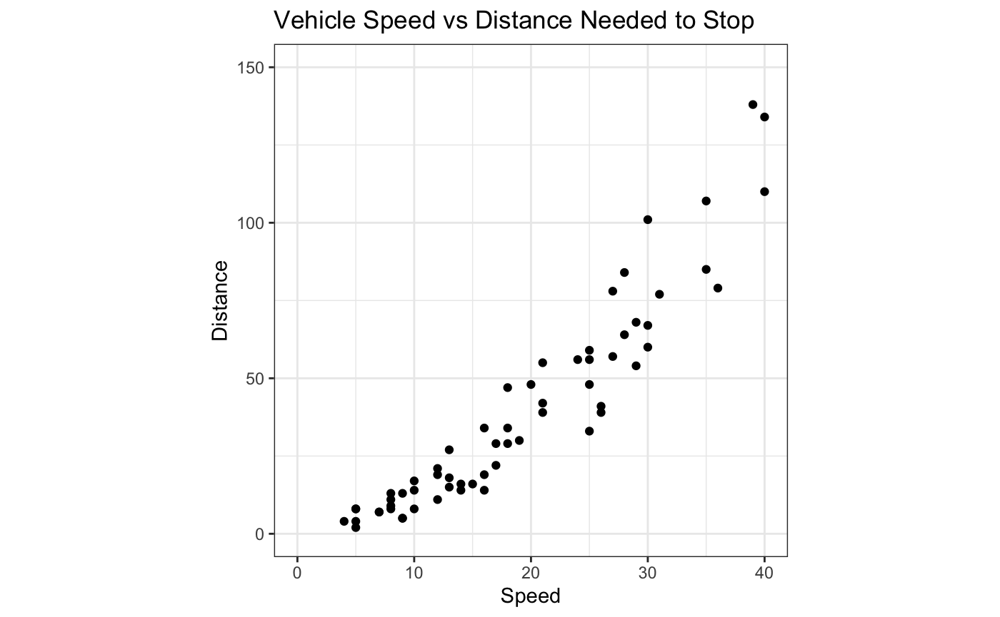
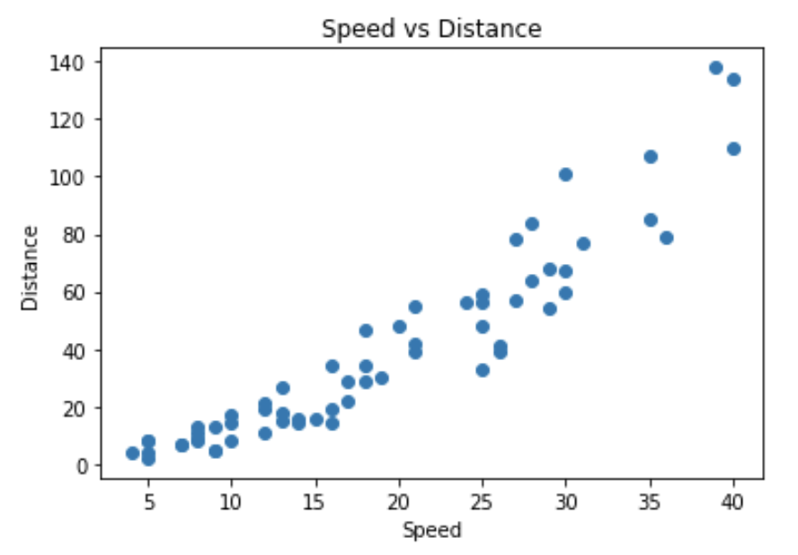
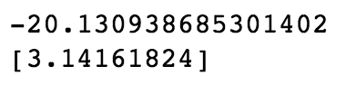

## Let's begin
Linear regression models are one of the most basic and stastistical predictive modeling methods because of their simplicity and interpretability. They are extremely useful in quantifying how one variable can impact an outcome variable as well as how multiple variables may interact with one another. R is one of the most common coding languages to perform these types of statistical analyses. However, there are other languages that you can use to perform linear regression models. This article specifically discusses how to perform a simple linear regression model in Python compared to R for all you Python users out there! We use a simple dataset about vehicle speeds (mph) and stopping distances (ft) to illustrate this process. This article includes both R code and Python code to compare syntax and reinforce knowledge of how to perform simple linear regression models. Let's get started.

## Car speeds and stopping distances
An important factor in determining appropriate speed limits is the amount of distance that is required to stop at a given speed. For example, in residential neighborhoods, it is important to be able to stop in a short distance to ensure pedestrain safety because people are commonly found on the streets. Therefore, the purpose of this analysis is to determine what distance is required to stop at a given vehicle speed through simple linear regression. With this knowledge, public officials can determine area speed limits and make better traffic control decisions.

Let's read in the data.

In R, this can be done with the ```read.csv``` function.

````md
```{r}
stop <- read.csv("StoppingDistance.txt", sep = " ", header = TRUE, stringsAsFactors = FALSE)
```
````
In Python however, it is common to use the ```pandas``` library in order to read in the data.  ```pandas``` is commonly used for for data manipulation and analysis in Python. It allows users to manipulate data frames and structures easily and efficiently. More information about the ```pandas``` library can be found at https://pandas.pydata.org/. Let's import the ```pandas``` library and read in the data set.

````md
```{python}
# import pandas library
import pandas as pd

# read in data set
stop = pd.read_csv("StoppingDistance.txt", sep = " ")
stop.head()
```
````


Next, we want to perform some exploratory data analysis (EDA) to better understand our data. In R, it is common to use ```ggplot``` or R-base plotting packages to create EDA graphs. In python, we can also create the same things using the ```matplotlib``` package. Let's compare the two languages.

````md
```{r}
stop_plot <- ggplot(data = stop, mapping = aes(x = Speed, y = Distance)) +
  geom_point() +
  theme_bw() +
  theme(aspect.ratio = 1) +
  scale_x_continuous(limits = c(0, 40)) +
  scale_y_continuous(limits = c(0, 150))
 stop_plot
```
````




````md
```{python}
# create scatterplot of speed and distance variable
plt.scatter(stop["Speed"], stop["Distance"])
```
````




Notice that for both graphs, speed and distance have a linear relationship. Because these variables are linearly related, we know that using a linear regression model is appropriate for this dataset. Now let us create a linear regression model. We create the model in R and in Python. 

````md
```{r}
stop_lm <- lm(Distance ~ Speed, data = stop)
```
````

````md
```{python}
# import sklearn package and linear_model library
from sklearn import linear_model

# save variables as x and y variables
x = stop[["Speed"]]
y = stop["Distance"]

# fit linear regression model 
lm_model = lm.LinearRegression(fit_intercept = True)
lm_model.fit(x, y)
```
````

Notice the difference in syntax between R and Python. In R, we can create the model in a single line including the name of the data as well as the x and y variables. The ```lm``` function is built into R which makes creating a linear model simple and straightfoward. 

In Python, however, it takes a few more lines to write. Because Python does not have these statistical computing capabilities on its own, we need to import various packages and libraries to create the model. ```sklearn``` is one of the most useful machine learning libraries for Python and allows users to perform machine learning and statistical modeling including classification, clustering, regression, and preprocessing. More about this package can be learned at https://scikit-learn.org/stable/. We import the ```sklearn``` library and the ```linear_model``` function in Python to run the regression model. With sklearn, we first need to create a linear regressiom model and then fit our x and y variables into that model separately. Notice that the function ```lm.LinearRegression``` creates a linear regression model that we call ```lm``` and then our x and y variables are fit into that model using the ```.fit``` function.

Great! You have successfully created a simple linear regression model! Let's look at the regression outputs.

````md
```{r}
summary(stop_lm)
```
````


````md
```{python}
# print model intercept, model coefficients, and R^2 score
print(lm_model.intercept_)
print(lm_model.coef_)
print(lm_model.score(x,y))
```
````




Notice that another difference between R and Python is that in R, you can get a full summary of the linear model including variable intercepts, coefficients, p-values, and adjusted $R^2$ values. In Python while using the ```sklearn``` library, you can only extract model parameters individually.

```statsmodels``` is another package used for Python where users can run linear regression models. This package also provides a more comprehensive summary of regression modeling that is performed. More about this package can be learned at https://www.statsmodels.org/stable/index-html.

At this point, you would now need to investigate whether this model you just created meets the linear model assumptions. However, I'll leave it up to you to determine those assumptions are met. However, here is a reminder of what those assumptions are as well as some methods you can use to see if the assumptions are met.
1. X and Y are linear: You can use scatterplots to visualize the linearity between each explanatory variable and response variable.
2. Residuals are normally distributed and centered at zero: You can use boxplots or histograms of model residuals to see if they are normally distributed.
3. Residuals have constant variance across all values of x: Scatterplots of fitted values measured against the model's residuals are great for this assumption.
4. Model describes all observations/no influential points: Scatterplot of x and y variables, boxplot of residuals, normal probability plot of the residuals, or Cook's distance calculations will work.

If you checked the assumptions correctly, you would have found that this model did indeed meet the assumptions! We can now interpret these results.
We see that the "speed" coefficient is 3.14. A correct interpretation of this coefficient is that for every one increase in mph of a vehicle, the distance at which the vehicle should stop also increases by 3.14 ft. Because the p-value of the model is less than 0.05, we can conclude that these result are statistically significant. These results can be useful for public officials so that they can determine area speed limits and make better traffic control decisions.

### Wrapping it all up
Even though R is the most common programming language to perform statistical analyses, these methods can be extended to other programming languages as long as the correct packages and libraries are used. Python uses the ```sklearn``` and ```matplotlib``` libraries to perform EDA and fit models. As long as you know what resources are available for your coding language of choice, you do not have to feel limited with only knowing one programming language. For you Python users, you can rest easy knowing you can run meaningful statistical analyses in the the Python language.

